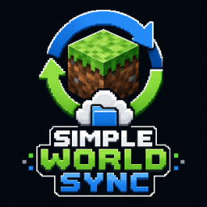

# 🌍 Simple World Sync

[🇷🇺 Русский](#русский) | [🇬🇧 English](#english)



---

## 🇷🇺 Русский

### 📌 Описание

**Simple World Sync** — клиентский Fabric-мод для Minecraft, который помогает синхронизировать одиночные миры между несколькими устройствами через обычную папку синхронизации.

Например:

* 🖥️ ПК ↔ 🗄️ NAS ↔ другое устройство (ПК, Steam Deck)
* 🖥️ ПК ↔ ☁️ Google Drive ↔ другое устройство (ПК, Steam Deck)
* 🖥️ ПК ↔ ☁️ Яндекс Диск ↔ другое устройство (ПК, Steam Deck)
* 🖥️ ПК ↔ 📁 любая локальная папка синхронизации ↔ другое устройство (ПК, Steam Deck)

Мод рассчитан на:

* Minecraft `1.21.1`
* Fabric Loader
* Java `21`

---

### 🧠 Почему появился этот мод

Мод создавался при помощи нейросети. Я понимаю, что для кого-то это может звучать не очень убедительно, но на полноценное изучение разработки Minecraft-модов на Java у меня ушло бы очень много времени.

Мне был нужен простой и понятный мод для личной задачи: синхронизировать одиночные миры Minecraft между моим NAS-сервером, компьютером и Steam Deck.

Изначально была идея использовать **MineGIT**, но с ним возникли сложности: блокировки в РФ, проблемы с доступом к GitHub/Gitea, HTTPS-сертификатами и общей настройкой.

Поэтому появилась идея сделать отдельный простой мод, который работает не через GitHub API и не через токены, а через обычную папку синхронизации.

Такой подход должен быть удобен тем, кто хочет синхронизировать миры через NAS, Google Drive, Яндекс Диск, Syncthing или любое другое приложение, которое умеет синхронизировать локальные папки.

---

### ⚙️ Как это работает

Мод не использует собственный сервер, GitHub API или внешнее облако. Вместо этого он работает с обычной папкой синхронизации.

Пользователь выбирает папку, например:

* 🗄️ сетевую папку NAS;
* 🔄 папку Syncthing;
* ☁️ папку Google Drive;
* ☁️ папку Яндекс Диска;
* 📁 любую другую локальную папку.

После этого мод может синхронизировать выбранные одиночные миры через эту папку.

```text
ПК
↓
папка синхронизации / NAS / облачный диск
↓
другое устройство (ПК, Steam Deck)
```

Для синхронизации мод использует:

* 🆔 `worldId` для определения конкретного мира;
* 📄 `manifest.json` для списка файлов;
* 🔄 инкрементальную синхронизацию;
* 📦 копирование только новых, изменённых и удалённых файлов;
* 📊 прогресс-экран;
* ⚠️ защиту от конфликтов;
* 🔒 lock-файлы для защиты от одновременной записи.

---

### ✨ Возможности

* 🌍 синхронизация одиночных миров между устройствами;
* 📁 работа через обычную папку, NAS или папку облачного диска;
* 🚀 автоматическая проверка перед запуском мира;
* 📤 автоматическая выгрузка после выхода из мира;
* 🔄 инкрементальная синхронизация по файлам;
* 📊 прогресс-экран с процентами, скоростью и оставшимся временем;
* ✅ поддержка включения и отключения синхронизации для отдельного мира;
* 🟢 отображение синхронизируемых миров в списке;
* ☁️ обнаружение миров, которые есть только на сервере;
* 📥 возможность скачать мир на устройство;
* 🗑️ возможность удалить серверную копию мира из папки синхронизации;
* 🧹 исключение мусорных и опасных файлов из синхронизации:

  * `session.lock`
  * `.git`
  * Distant Horizons SQLite-файлы;
* 🔒 защита от одновременной записи через lock-файл.

---

### 📥 Установка

1. Установите **Fabric Loader** для Minecraft `1.21.1`.
2. Установите **Fabric API**.
3. Скачайте `.jar` мода из **Releases**.
4. Поместите `.jar` в папку `mods`.
5. Запустите Minecraft.

Пример для Prism Launcher:

```text
Prism Launcher → Instance → Edit → Mods → Add File
```

---

### 🕹️ Использование

1. Откройте Minecraft.
2. Откройте экран `Синхронизация миров`.
3. Выберите папку синхронизации.
4. Выберите мир.
5. Нажмите `Синхронизировать этот мир`.
6. После этого мод будет автоматически:

   * проверять актуальность мира перед запуском;
   * скачивать изменения при необходимости;
   * выгружать изменения после выхода из мира.

Если мир есть только в папке синхронизации, мод покажет его как облачный мир. Такой мир можно скачать на устройство или удалить серверную копию из папки синхронизации.

---

### ⚠️ Важно

* Не запускайте один и тот же мир одновременно на двух устройствах.
* Дождитесь завершения синхронизации перед запуском мира на другом устройстве.
* Перед первым использованием сделайте ручную резервную копию мира.
* NAS или облачная папка должны быть доступны до запуска Minecraft.
* Если используется Google Drive, Яндекс Диск, Syncthing или похожий инструмент, дождитесь окончания их собственной синхронизации.
* Мод не является официальным продуктом Mojang/Microsoft.

---

### 🚧 Ограничения

* мод рассчитан на одиночные миры;
* мод не заменяет полноценный сервер Minecraft;
* конфликтные изменения нужно решать вручную;
* синхронизация зависит от доступности выбранной папки, NAS или облачного клиента;
* большие миры всё равно могут синхронизироваться долго при первом запуске.

---

### 💬 Обратная связь

Если у вас есть идеи, предложения по улучшению, сообщения об ошибках или варианты доработки мода — буду рад обратной связи.

Можно создавать **Issue** на GitHub и описывать:

* что именно не работает;
* какая версия Minecraft и Fabric используется;
* какая ОС и устройство используются;
* как настроена папка синхронизации;
* что ожидалось и что произошло на самом деле.

Предложения по новым функциям тоже приветствуются.

---

## 🇬🇧 English

### 📌 Description

**Simple World Sync** is a client-side Fabric mod for Minecraft `1.21.1` that helps synchronize singleplayer worlds between multiple devices through a normal sync folder.

Examples:

* 🖥️ PC ↔ 🗄️ NAS ↔ another device (PC, Steam Deck)
* 🖥️ PC ↔ ☁️ Google Drive ↔ another device (PC, Steam Deck)
* 🖥️ PC ↔ ☁️ Yandex Disk ↔ another device (PC, Steam Deck)
* 🖥️ PC ↔ 📁 any local sync folder ↔ another device (PC, Steam Deck)

The mod targets:

* Minecraft `1.21.1`
* Fabric Loader
* Java `21`

---

### 🧠 Why this mod exists

This mod was created with the help of AI. I understand that this may not sound ideal to everyone, but learning Minecraft mod development in Java from scratch would take a lot of time.

I needed a simple tool for my own use case: synchronizing singleplayer Minecraft worlds between my NAS server, PC, and Steam Deck.

At first, I considered using **MineGIT**, but it did not work well for my situation because of access restrictions in Russia, GitHub/Gitea access issues, HTTPS certificate problems, and setup complexity.

That is why I decided to make a simpler mod that does not rely on GitHub APIs, tokens, or a dedicated server. Instead, it works with a normal local sync folder.

This approach should be useful for people who want to sync Minecraft worlds through a NAS, Google Drive, Yandex Disk, Syncthing, or any other application that can synchronize local folders.

---

### ⚙️ How it works

The mod does not use its own server, GitHub API, or an external cloud service. Instead, it works with a normal folder on your filesystem.

You choose a sync folder, for example:

* 🗄️ a NAS network folder;
* 🔄 a Syncthing folder;
* ☁️ a Google Drive folder;
* ☁️ a Yandex Disk folder;
* 📁 any other local folder.

After that, the mod can synchronize selected singleplayer worlds through this folder.

```text
PC
↓
sync folder / NAS / cloud drive
↓
another device (PC, Steam Deck)
```

The mod uses:

* 🆔 `worldId` to identify a specific world;
* 📄 `manifest.json` to track world files;
* 🔄 incremental file-based synchronization;
* 📦 copying only new, changed, and deleted files;
* 📊 a progress screen;
* ⚠️ conflict protection;
* 🔒 lock files to protect against simultaneous writes.

---

### ✨ Features

* 🌍 synchronize singleplayer worlds between devices;
* 📁 works through a normal folder, NAS, or cloud-drive folder;
* 🚀 automatic check before launching a world;
* 📤 automatic upload after leaving a world;
* 🔄 incremental file-based synchronization;
* 📊 progress screen with percentage, speed, and estimated time remaining;
* ✅ enable or disable sync per world;
* 🟢 synced-world indicator in the world list;
* ☁️ detection of worlds that exist only in the sync folder;
* 📥 download a remote world to the current device;
* 🗑️ delete a server-side or remote copy from the sync folder;
* 🧹 excludes unsafe or unnecessary files:

  * `session.lock`
  * `.git`
  * Distant Horizons SQLite files;
* 🔒 lock-file protection against simultaneous writes.

---

### 📥 Installation

1. Install **Fabric Loader** for Minecraft `1.21.1`.
2. Install **Fabric API**.
3. Download the mod `.jar` from **Releases**.
4. Put the `.jar` into your `mods` folder.
5. Launch Minecraft.

Prism Launcher example:

```text
Prism Launcher → Instance → Edit → Mods → Add File
```

---

### 🕹️ Usage

1. Open Minecraft.
2. Open the `World Sync` / `Синхронизация миров` screen.
3. Choose a sync folder.
4. Select a world.
5. Click `Sync this world`.
6. After that, the mod will automatically:

   * check the world before launch;
   * download changes when needed;
   * upload changes after leaving the world.

If a world exists only in the sync folder, the mod shows it as a remote world. You can download it to the current device or delete its server-side copy from the sync folder.

---

### ⚠️ Important notes

* Do not open the same world on two devices at the same time.
* Wait for synchronization to finish before launching the world on another device.
* Make a manual backup before first use.
* Your NAS or cloud-drive folder must be available before launching Minecraft.
* If you use Google Drive, Yandex Disk, Syncthing, or similar tools, wait until their own synchronization finishes.
* This mod is not an official Mojang/Microsoft product.

---

### 🚧 Limitations

* designed for singleplayer worlds;
* not a replacement for a Minecraft server;
* sync conflicts may require manual decisions;
* synchronization depends on the availability of the selected folder, NAS, or cloud client;
* large worlds may still take time during the first sync.

---

### 💬 Feedback

If you have ideas, suggestions, bug reports, or feature requests, feel free to open an Issue on GitHub.

When reporting a problem, please include:

* what exactly does not work;
* your Minecraft and Fabric versions;
* your operating system and device;
* how the sync folder is configured;
* what you expected to happen and what happened instead.
